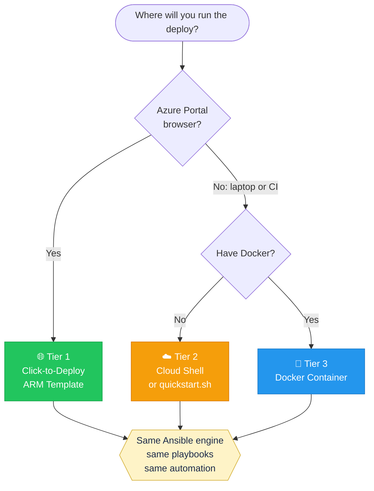
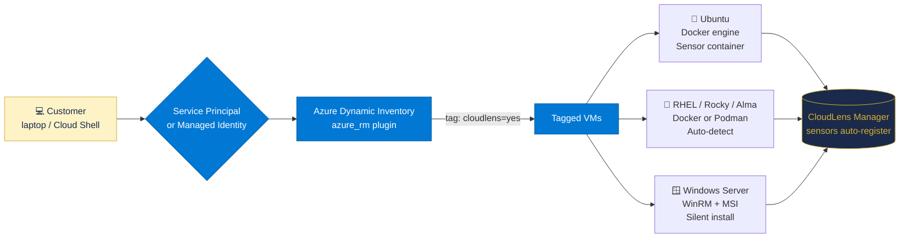

# CloudLens Ansible for Azure

**Deploy CloudLens sensors to any Azure VM in under 60 seconds. Works on Linux, Windows, and at scale.**




<p align="center">
  <a href="https://portal.azure.com/#create/Microsoft.Template/uri/https%3A%2F%2Fraw.githubusercontent.com%2FKeysight-Tech%2Fcloudlens-ansible-azure%2Fmain%2Fdeploy%2Farm-template.json"></a>
  <a href="https://shell.azure.com"></a>
  <a href="https://github.com/Keysight-Tech/cloudlens-ansible-azure/pkgs/container/cloudlens-ansible-azure"></a>
</p>

---

## Which path?

### Interactive Diagram



### Detailed Diagram



All three paths run the same Ansible engine. Same playbooks, same automation. Pick the entry point that matches how your team works.

---

## Supported VM Scenarios



| OS / Topology | Public IP direct | Private + Jumpbox | Azure Bastion | Cloud Shell |
|---|:---:|:---:|:---:|:---:|
| Ubuntu 20.04 / 22.04 / 24.04 | ✓ | ✓ | ✓ | ✓ |
| RHEL 7 / 8 / 9 | ✓ | ✓ | ✓ | ✓ |
| CentOS / Rocky / AlmaLinux | ✓ | ✓ | ✓ | ✓ |
| Windows Server 2019 / 2022 | ✓ | (planned) | (planned) | ✓ |

---

## Choose Your Scenario

Click the row that matches your environment to see the exact commands.

<details>
<summary>🐧 Ubuntu VMs with public IPs</summary>

**1. Tag your VMs:**
```bash
az vm update -g <RG> -n <VM> --set tags.cloudlens=yes tags.os=ubuntu tags.env=prod
```

**2. Set connection mode in customer_input.yaml:**
```yaml
connection:
  mode: "direct_public"
clms:
  ip: "10.0.0.10"
  project_key: "<your-project-key>"
```

**3. Deploy:**
```bash
bash quickstart.sh
```

Expected: Each VM gets `cloudlens-agent` container running, registered to CLMS within 60 seconds of deploy completion.
</details>

<details>
<summary>🐧 Ubuntu VMs in private subnet (jumpbox required)</summary>

**1. Tag your VMs and jumpbox:**
```bash
az vm update -g <RG> -n <VM> --set tags.cloudlens=yes tags.os=ubuntu tags.env=prod
az vm update -g <RG> -n <JUMPBOX> --set tags.cloudlens_role=jumpbox
```

**2. Set connection mode in customer_input.yaml:**
```yaml
connection:
  mode: "jumpbox"
  jumpbox_host: "jumpbox.example.com"
  jumpbox_user: "azureuser"
clms:
  ip: "10.0.0.10"
  project_key: "<your-project-key>"
```

**3. Deploy:**
```bash
bash quickstart.sh
```

Expected: SSH ProxyJump through jumpbox to each private VM, Docker engine installed, sensor container running and registered to CLMS.
</details>

<details>
<summary>🎩 RHEL/Rocky VMs with Podman</summary>

**1. Tag your VMs:**
```bash
az vm update -g <RG> -n <VM> --set tags.cloudlens=yes tags.os=rhel tags.env=prod
```

**2. Set connection mode in customer_input.yaml:**
```yaml
connection:
  mode: "direct_public"
container:
  runtime: "auto"
clms:
  ip: "10.0.0.10"
  project_key: "<your-project-key>"
```

**3. Deploy:**
```bash
bash quickstart.sh
```

Expected: Playbook auto-detects Podman on RHEL 8/9 (or Docker if installed), launches sensor with the correct runtime, registers to CLMS.
</details>

<details>
<summary>🪟 Windows Server VMs (WinRM)</summary>

**1. Tag your VMs:**
```bash
az vm update -g <RG> -n <VM> --set tags.cloudlens=yes tags.os=windows tags.env=prod
```

**2. Enable WinRM on each target (one-shot bootstrap if not already enabled):**
```bash
ansible-playbook playbooks/bootstrap_windows_winrm.yaml
```

**3. Set connection mode in customer_input.yaml:**
```yaml
connection:
  mode: "direct_public"
  winrm_user: "azureuser"
  winrm_password: "<secret>"
clms:
  ip: "10.0.0.10"
  project_key: "<your-project-key>"
```

**4. Deploy:**
```bash
bash quickstart.sh
```

Expected: Silent MSI install of CloudLens Windows sensor, service started, registered to CLMS within 60 seconds. Verified end-to-end on Windows Server 2022.
</details>

<details>
<summary>🌐 Mixed environment: Linux + Windows in same RG</summary>

**1. Tag every VM with its correct OS:**
```bash
# Ubuntu hosts
az vm update -g <RG> -n <UBUNTU_VM> --set tags.cloudlens=yes tags.os=ubuntu tags.env=prod
# RHEL hosts
az vm update -g <RG> -n <RHEL_VM> --set tags.cloudlens=yes tags.os=rhel tags.env=prod
# Windows hosts
az vm update -g <RG> -n <WIN_VM> --set tags.cloudlens=yes tags.os=windows tags.env=prod
```

**2. Set connection mode in customer_input.yaml:**
```yaml
connection:
  mode: "direct_public"
  winrm_user: "azureuser"
  winrm_password: "<secret>"
clms:
  ip: "10.0.0.10"
  project_key: "<your-project-key>"
```

**3. Deploy:**
```bash
bash quickstart.sh
```

Expected: Single run fans out to all three OS lanes in parallel, each VM gets the correct sensor (container for Linux, MSI for Windows), all register to the same CLMS project.
</details>

<details>
<summary>🛡 Behind Azure Bastion (no public IPs allowed)</summary>

**1. Tag your VMs:**
```bash
az vm update -g <RG> -n <VM> --set tags.cloudlens=yes tags.os=ubuntu tags.env=prod
```

**2. Set connection mode in customer_input.yaml:**
```yaml
connection:
  mode: "bastion"
  bastion_name: "<bastion-resource-name>"
  bastion_rg: "<bastion-resource-group>"
clms:
  ip: "10.0.0.10"
  project_key: "<your-project-key>"
```

**3. Deploy from Cloud Shell (recommended for Bastion-only orgs):**
```bash
curl -sSL https://raw.githubusercontent.com/Keysight-Tech/cloudlens-ansible-azure/main/quickstart.sh | bash
```

Expected: Ansible tunnels through Azure Bastion to each private VM, deploys sensor, registers to CLMS. No public IP ever exposed on the target VMs.
</details>

---

## Architecture

### Interactive Diagram



### Detailed Diagram



A single Ansible control point authenticates to Azure, discovers VMs by tag, and routes each host to the OS-specific playbook lane (Ubuntu, RHEL, Windows). Every sensor self-registers with CloudLens Manager (CLMS) on first start. No manual per-VM steps, no inventory files to maintain.

---

## Need CLMS or vPB first?

If you do not have CloudLens Manager or a Virtual Packet Broker running yet, deploy them from Azure Marketplace in one click.

<p align="center">
  <a href="https://portal.azure.com/#create/Microsoft.Template/uri/https%3A%2F%2Fraw.githubusercontent.com%2FKeysight-Tech%2Fcloudlens-ansible-azure%2Fmain%2Fdeploy%2Fclms-marketplace.json"></a>
  <a href="https://portal.azure.com/#create/Microsoft.Template/uri/https%3A%2F%2Fraw.githubusercontent.com%2FKeysight-Tech%2Fcloudlens-ansible-azure%2Fmain%2Fdeploy%2Fvpb-marketplace.json"></a>
</p>

| Component | Version | Marketplace |
|---|---|---|
| CLMS (CloudLens Manager) | 6.13.076 | keysight-technologies-cloudlens/keysight-cloudlens-manager-preview |
| vPB (Virtual Packet Broker) | 3.15.01 | keysight-technologies-cloudlens/keysight-cloudlens-virtual-packet-broker |

> **Note about the marketplace name:** When accepting terms via the Azure Portal, the CLMS offer appears as **"CloudLens Manager (Preview)"** and the vPB offer appears as **"CloudLens Virtual Packet Broker"**. The Deploy buttons above point to the correct offer IDs automatically.

After CLMS deploys (about 15 minutes for initialization), open the UI, create a project, copy the project key, then run the sensor deployment using one of the three paths below.

> First-time use of these images requires accepting Marketplace terms. Either click through the Marketplace acceptance dialog when deploying from the portal, or run:
> ```bash
> az vm image terms accept --publisher keysight-technologies-cloudlens --offer keysight-cloudlens-manager-preview --plan clms-6-13-0_76
> az vm image terms accept --publisher keysight-technologies-cloudlens --offer keysight-cloudlens-virtual-packet-broker --plan cloudlens-virtual-packet-broker-3-15-0_1
> ```

### Prefer Terraform?

Engineers managing infrastructure as code can use Terraform modules instead:

```bash
cd deploy/terraform/clms
cp terraform.tfvars.example terraform.tfvars
# Edit terraform.tfvars with your values
terraform init && terraform apply
```

Same marketplace images, same outputs. See [deploy/terraform/](deploy/terraform/) for details.

---

## The 3 Deployment Paths

### 🌐 Tier 1: One-Click from Azure Portal

> Deploy directly from the Azure Portal. No local tools, no CLI, no SSH keys.

<p>
  <a href="https://portal.azure.com/#create/Microsoft.Template/uri/https%3A%2F%2Fraw.githubusercontent.com%2FKeysight-Tech%2Fcloudlens-ansible-azure%2Fmain%2Fdeploy%2Farm-template.json"></a>
</p>

<details>
<summary>How it works</summary>

- Provisions an ephemeral Ubuntu runner VM in your subscription
- Runner authenticates via Managed Identity (no Service Principal to create)
- Auto-discovers tagged VMs, deploys sensors, self-destructs after 1 hour
- Zero local tools required: runs entirely from your browser

</details>

### ☁️ Tier 2: Azure Cloud Shell

> If you are already logged into Azure in your browser, run a single curl command.

```bash
curl -sSL https://raw.githubusercontent.com/Keysight-Tech/cloudlens-ansible-azure/main/quickstart.sh | bash
```

<details>
<summary>How it works</summary>

- Cloud Shell is pre-authenticated to Azure, so no Service Principal is needed
- Wizard prompts for CLMS IP and project key
- Auto-tunes Ansible forks based on discovered VM count
- All state lives in your Cloud Shell home directory; nothing installed locally

</details>

### 🐳 Tier 3: Docker (local PC or CI/CD)

> Run from your laptop, a CI runner, or any container host. Reproducible, hermetic, version-pinned.

```bash
docker run --rm -it \
  -v $(pwd)/customer_input.yaml:/work/customer_input.yaml \
  -v $HOME/.ssh:/root/.ssh:ro \
  -e AZURE_SUBSCRIPTION_ID -e AZURE_TENANT \
  -e AZURE_CLIENT_ID -e AZURE_SECRET \
  ghcr.io/keysight-tech/cloudlens-ansible-azure:latest
```

<details>
<summary>How it works</summary>

- Pinned container image with Ansible, Azure collections, and all Python deps baked in
- Mounts your `customer_input.yaml` and SSH keys read-only
- Service Principal credentials passed via env vars (use `scripts/setup_azure_sp.sh` to create one)
- Works identically on macOS, Windows, Linux, GitHub Actions, GitLab CI, Jenkins

</details>

---

## Prerequisites: Tag Your VMs

The dynamic inventory discovers VMs by Azure tag. Apply these three tags to every target VM:

| Tag | Required Value |
|---|---|
| `cloudlens` | `yes` |
| `os` | `ubuntu` \| `rhel` \| `windows` |
| `env` | `prod` (or `dev`, `qa`) |

Bulk-tag a resource group:

```bash
# All Ubuntu VMs in a resource group
for vm in $(az vm list -g <RG> --query "[?storageProfile.imageReference.offer=='0001-com-ubuntu-server-jammy'].name" -o tsv); do
  az vm update -g <RG> -n $vm --set tags.cloudlens=yes tags.os=ubuntu tags.env=prod
done

# All RHEL VMs in a resource group
for vm in $(az vm list -g <RG> --query "[?storageProfile.imageReference.publisher=='RedHat'].name" -o tsv); do
  az vm update -g <RG> -n $vm --set tags.cloudlens=yes tags.os=rhel tags.env=prod
done

# All Windows VMs in a resource group
for vm in $(az vm list -g <RG> --query "[?storageProfile.osDisk.osType=='Windows'].name" -o tsv); do
  az vm update -g <RG> -n $vm --set tags.cloudlens=yes tags.os=windows tags.env=prod
done
```

---

## Scaling: From 1 VM to 5,000+

| VM Count | Auto Forks | Sharded? | Approx Time |
|---|---|---|---|
| 1–50 | 20 | No | 5–10 min |
| 50–500 | 50 | No | 15–30 min |
| 500–2,000 | 200 | No | 30–60 min |
| 2,000–10,000 | 500/shard | Yes (auto) | 30–60 min |
| 10,000+ | 1000/shard | AWX | 1–2 hr |

Auto-tunes based on discovered VM count. See [docs/SCALING.md](docs/SCALING.md) for details.

---

## Verified Against Real Azure

| Scenario | Result | Time |
|---|---|---|
| Ubuntu 22.04 (private IP via jumpbox) | ✓ Sensor running | 4 min |
| Ubuntu 22.04 (private IP via jumpbox) | ✓ Sensor running | 4 min |
| Windows Server 2022 (WinRM direct) | ✓ Sensor running | 6 min |
| CLMS 6.14.141 registration | ✓ All 3 sensors registered | <1 min |
| **End-to-end** | **3/3 success** | **8 min** |

Date verified: 2026-06-02. Subscription: CloudLensPublic (eastus2).

---

## Troubleshooting Quick Reference

| Symptom | Cause | Fix |
|---|---|---|
| Inventory finds 0 VMs | Tags missing | `az vm update --set tags.cloudlens=yes tags.os=ubuntu tags.env=prod` |
| SSH "Permission denied" | Public key not on target | Bootstrap via `az vm run-command invoke` |
| WinRM timeout | WinRM disabled on Windows VM | Run `playbooks/bootstrap_windows_winrm.yaml` |
| `apt_pkg.Error: Signed-By` | Stale Docker apt source | Playbook auto-cleans on next run |
| Sensor not in CLMS UI | Wrong project key | Check CLMS → Projects → API Keys |
| Just deployed vPB, SSH not ready | Internal CLI service still initializing | Wait 10 to 15 minutes after the Azure deploy finishes, then SSH |
| Just deployed CLMS, UI not ready | System initialization still running | UI on port 443 ready in ~60s, full init takes ~15 minutes |

Full reference: [docs/TROUBLESHOOTING.md](docs/TROUBLESHOOTING.md).

---

## Documentation

- [docs/ARCHITECTURE.md](docs/ARCHITECTURE.md): internal architecture and traffic flow
- [docs/DEPLOYMENT_GUIDE.md](docs/DEPLOYMENT_GUIDE.md): step-by-step customer guide
- [docs/SCALING.md](docs/SCALING.md): scale to thousands of VMs
- [docs/TROUBLESHOOTING.md](docs/TROUBLESHOOTING.md): common issues and fixes

## Related Repositories

- [cloudlens-vpb-azure-gwlb](https://github.com/Keysight-Tech/cloudlens-vpb-azure-gwlb): Virtual Packet Broker HA behind Azure Gateway Load Balancer

## Getting Help

- [GitHub Issues](https://github.com/Keysight-Tech/cloudlens-ansible-azure/issues) for bug reports and feature requests
- Keysight CloudLens engineering: contact your account team

## License

Keysight Technologies. See [LICENSE](LICENSE).

---

**Version:** v1.0.0 (June 2026)
