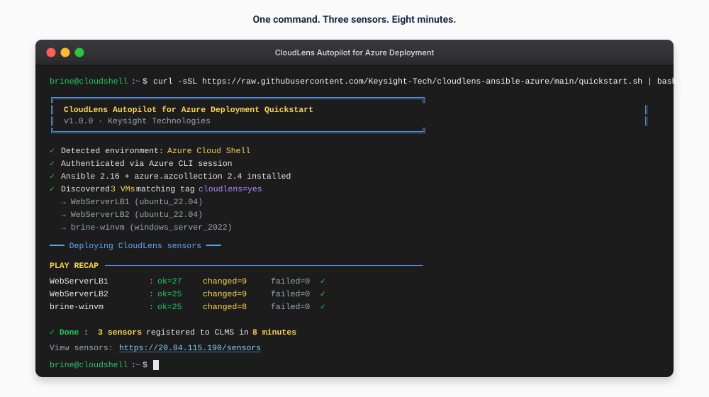
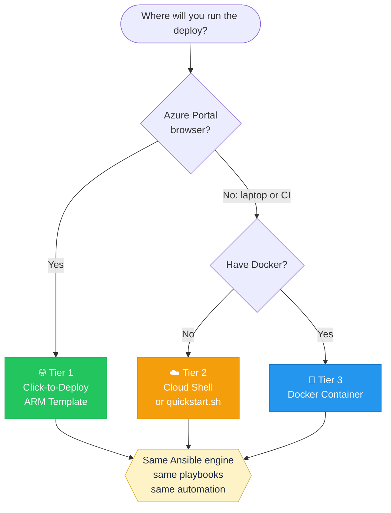
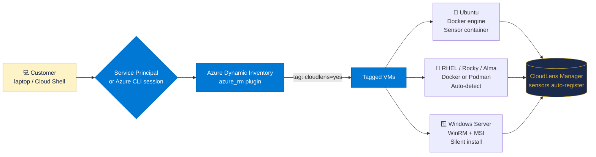

# CloudLens Autopilot for Azure

**Deploy CloudLens sensors to any Azure VM in under 60 seconds. Works on Linux, Windows, and at scale.**




<p align="center">
  <a href="https://portal.azure.com/#create/Microsoft.Template/uri/https%3A%2F%2Fraw.githubusercontent.com%2FKeysight-Tech%2Fcloudlens-ansible-azure%2Fmain%2Fdeploy%2Farm-template.json"></a>
  <a href="https://shell.azure.com"></a>
  <a href="https://github.com/Keysight-Tech/cloudlens-ansible-azure/pkgs/container/cloudlens-ansible-azure"></a>
</p>

---

## Deploy the full stack with one command

Three ways to deploy vController + KVO (optional) + vPB + sensors end to end. Same result, different workflows.

> **Naming note:** Keysight rebranded CLMS to **vController** in 2026 (Marketplace offer `keysight-cloudlens-vcontroller`). The runbook now uses the new offer; the legacy `keysight-cloudlens-manager-preview` no longer exists in Azure Marketplace. **KVO** (Keysight Vision Orchestrator) is a new optional component that centrally manages vPB fleets and is wired into the deploy stack behind the `--with-kvo` flag (or `deploy_kvo = true` in Terraform).

### Bash (recommended)

```bash
curl -sSL https://raw.githubusercontent.com/Keysight-Tech/cloudlens-ansible-azure/main/deploy/deploy-stack.sh | bash
```

**One network, every appliance.** The deploy builds a single virtual network,
`cloudlens-vnet` (10.50.0.0/16), with the same five subnets the portal's
full-stack form creates, and hands it to the vController, the KVO and the vPB.
Earlier versions let each product template build its own VNet, which left three
networks with no peering between them and appliances that could not reach each
other. A re-run against a group where an older vController already built
`<name>-vnet` adopts that network and adds the missing subnets to it. To use a
VNet you already run, pass `--vnet-name` (and `--vnet-resource-group` if it is
elsewhere); it must already contain the five subnets, which the deploy checks
and never creates in a network it did not build.

**No manual project key.** Once the vController answers, Phase 10 completes
its forced first-login password change, creates the project
(`cloudlens-autopilot`, or `CLOUDLENS_PROJECT`) and uses its API key as the
project key. The new UI password is recorded in
`~/.cloudlens-vcontroller-creds-<resource-group>.json` (mode 600) before the
change is requested and verified by logging in afterwards; the file is only
trusted when it names this vController, so a redeploy into the same group does
not inherit a dead password. With `--with-kvo` the run continues: Phase 12
activates the codes in `CLOUDLENS_LICENSE_CODES` on the KVO (waiting for a KVO
that is still booting), Phase 13 adopts the vController and creates its Cloud
Config, Phase 14 adopts the vPB and Phase 15 prints the
`scripts/vpb_wire_path.py` command that wires the traffic path, for you to run
once the vPB data ports (eth1/eth2) are up. On the Azure Marketplace vPB image
Phase 14 is skipped; `docs/AZURE_TAPPING_ARCHITECTURE.md` explains where the
adoption stops on that image. An unlicensed KVO refuses every write, so set
the codes before the run or re-run with `--resume` after setting them.

**Where the sensors register.** With the admin CIDR left at `*` the sensors are
pointed at the vController's public IP, which works from any VNet. Once the
CIDR is narrowed the public IP is refused from inside the virtual network
(Azure translates VNet-to-public traffic to a source outside the CIDR), so the
deploy writes the vController's private IP into `customer_input.yaml` instead;
it is reachable from `cloudlens-vnet` and every VNet peered to it. Workload VMs
in an unpeered VNet need the public address and their egress IPs inside the
admin CIDR: set `CLOUDLENS_SENSOR_MANAGER_ADDR` to that public IP before the
run. The summary prints the chosen address as "Sensors register on".

**Kubernetes pods too.** Pod-to-pod traffic inside an AKS node never reaches a
VM sensor; the CloudLens Kubernetes sensor sees it. `--aks-cluster NAME` taps an
existing AKS cluster in the resource group and `--aks-sample` builds a small
test cluster (two nodes, Azure CNI on the shared VNet) with a demo app that
generates continuous pod-to-pod HTTP. Phase 13b runs after the vController
adoption: with KVO it creates the Kubernetes presence first (`k8s-<cluster>`,
with its own vController project and Cloud Config) and the sensor DaemonSet
registers with that presence's key; without KVO the pods register into the
Phase 10 project. One privileged sensor pod per node (`--aks-mode daemonset`,
the default, applied with kubectl, no helm) or a rendered sidecar snippet for
your own Deployments (`--aks-mode sidecar`, never an automatic restart). The
sensor image goes to an ACR the deploy creates and attaches to the cluster
(`--aks-sensor-tar`), or comes from a registry the nodes already reach
(`--aks-sensor-image`). Pods in the shared VNet register on the vController's
private address. Proven live on 2026-10-07: the DaemonSet ran on both nodes
and KVO's Kubernetes presence reported both sensors.

**Tear it down** when you are done, to remove everything that deployment
created. Put your resource group name in. It audits first, shows what it
found, and asks before deleting anything:

```bash
curl -sSL https://raw.githubusercontent.com/Keysight-Tech/cloudlens-ansible-azure/main/deploy/teardown-stack.sh | bash -s -- --resource-group YOUR-RG
```

Add `--audit` (`--orphans` is an alias) to see what it would delete and which
CloudLens resources the group holds without deleting anything (it never touches
the KVO), or `--dry-run` to print every command it would run.

If the group has a KVO, the script offers to release its licences before
deleting anything. Once you have confirmed the teardown it lists what the KVO
holds and asks "Release all N licences from this KVO now?" (default yes;
`--release-licences` answers it when there is no terminal). That order is
deliberate: licences are only ever stripped from a KVO you have already chosen
to destroy, never from one you then decide to keep. The counts return to your
entitlement while the KVO is alive; once it is deleted they cannot be
recovered. A release that leaves the KVO clear is the only thing that skips the
licence-loss confirmation; otherwise the script says why and makes you type the
resource group name to accept the loss (`--accept-licence-loss` when there is
no terminal). The UI route still works too: release them yourself first, in the
KVO under Settings > Product Licensing > Deactivate licenses, then run the
teardown.

It only removes what the deployment built. When the deploy created the resource
group (it tags it `deployedBy=cloudlens-stack`) and nothing else has been added
to it, the whole group is deleted. Otherwise only the CloudLens VMs and the
disks, NICs, public IPs, NSGs and VNets the templates created for them go, and
the group and everything else in it are left alone (`--keep-resource-group`
forces that narrower scope even on a group the deploy created). Older deployments left OS disks and NICs
behind when a VM was deleted; the templates now set `deleteOption` so they go
with the VM, and the script removes such leftovers either way. A VNet that
still carries NICs from outside the group, for example workload VMs you placed
in `cloudlens-vnet` to reach the vController on its private address, or a
customer VNet joined with `--vnet-name`, is left in place together with the
group; the audit names the NICs that keep it. What the AKS step stamped with
both `deployedBy=cloudlens-stack` and `cloudlens:stack=<stack>` goes too: the
sample AKS cluster (deleted through the AKS service, which removes its
`MC_` node resource group), the ACR, and the kubeconfig the deploy wrote at
`~/.kube/cloudlens-aks-<cluster>`. An untagged cluster or registry is left
alone and keeps the group, like any other resource that is not CloudLens.
Pointed at a cluster's `MC_` node resource group, the script refuses and
names the group the cluster is in; a cluster delete that Azure refuses keeps
the group too, so the group delete cannot hang on it.

**Prerequisites the script handles for you:**
- Azure CLI (`az`): auto-installed if missing (macOS via Homebrew, Debian via apt, RHEL via dnf)
- Python 3 + venv + Ansible + Azure SDK: installed into a venv during Phase 11 (sensor install)
- Git: used to auto-clone the repo for Phase 11 if not already present

**Prerequisites you need:**
- A bash shell (built-in on macOS / Linux / WSL / Azure Cloud Shell)
- Python 3 (built-in on macOS, default on Linux, in Cloud Shell, in WSL)
- An Azure subscription you have Contributor on

#### Windows users

Ansible's control node does **not** run natively on Windows. Three supported paths, easiest first:

| Path | What it is | Setup time |
|---|---|---|
| **Azure Cloud Shell** (best) | Open https://shell.azure.com in your browser, paste the curl line. Pre-authenticated, Ansible-ready, zero local install. | 0 min |
| **WSL** | Windows Subsystem for Linux: `wsl --install` then run the curl line from WSL. | 5 min |
| **Linux jumpbox VM** | A small VM you SSH into. Useful if your security policy blocks Cloud Shell. | 10 min |

The deploy-stack.sh detects Git Bash / Cygwin / MSYS and warns you before trying to install sensors, so you do not lose product progress if you start in the wrong shell.

### Terraform stack module

```bash
cd deploy/terraform/stack
cp terraform.tfvars.example terraform.tfvars
terraform init && terraform apply
```

### Printable runbook

[CloudLens_Stack_Deployment_Runbook.pdf](docs/CloudLens_Stack_Deployment_Runbook.pdf) is the executive-facing guide (June 2026 edition: it predates the shared VNet, the admin CIDR prompt, the automatic project key and the teardown script; this README is current). Hand it to procurement or training teams.

The bash script and the Terraform stack module create the same Azure resources: one resource group, one shared VNet, the vController, KVO (optional) and vPB. Only `deploy-stack.sh` accepts the Marketplace terms for you, creates the project key, licenses and wires KVO, and chains into the sensor install; after `terraform apply`, accept the terms once with the `az vm image terms accept` commands below and run `quickstart.sh` for the sensors. The runbook describes the bash flow.

### Configuration & overrides (bash deploy/deploy-stack.sh)

Every default is overridable three ways: **CLI flag wins over env var wins over hardcoded default**. Run `bash deploy/deploy-stack.sh --help` for the in-script reference, or use this table:

| Default | CLI flag | Env var | Notes |
|---|---|---|---|
| `cloudlens-rg` | `--resource-group <name>` | `CLOUDLENS_RG` | New or existing RG name |
| `eastus2` | `--location <region>` | `CLOUDLENS_REGION` | Any Azure region |
| `azureuser` | `--admin-user <name>` | `CLOUDLENS_ADMIN_USER` | OS-level SSH user across all VMs |
| `*` | `--admin-cidr <cidr>` | `CLOUDLENS_ADMIN_CIDR` | Network allowed to reach SSH 22, vPB SSH 9022 and HTTPS 443 on the appliances. Asked interactively; your own public address as a /32 is offered. It never restricts traffic inside the virtual network: Azure's default `AllowVnetInBound` rule admits it, and the templates add explicit `VirtualNetwork` rules for 443 (and 7443 on the KVO), so the KVO, the sensors and AKS pods reach the appliances on their private addresses. Mirrored traffic (VXLAN) is allowed from the VNet separately |
| `cloudlens-vnet` | `--vnet-name <name>` | `CLOUDLENS_VNET_NAME` | Join a VNet you already run instead of building one. It must hold the five subnets the templates expect: `vcontroller-subnet`, `kvo-subnet`, `vpb-mgmt`, `vpb-ingress`, `vpb-egress`; missing ones are named, never invented |
| the deploy's group | `--vnet-resource-group <rg>` | `CLOUDLENS_VNET_RG` | Where that VNet lives |
| `10.50.0.0/16` | `--vnet-cidr <cidr>` | `CLOUDLENS_VNET_CIDR` | Address space of the VNet the deploy builds, a /16; the subnets are carved as a.b.1, 2, 10, 11 and 12 .0/24 |
| `vcontroller` | `--vcontroller-name <name>` | `CLOUDLENS_VCONTROLLER_NAME` | VM name prefix |
| `kvo` | `--kvo-name <name>` | `CLOUDLENS_KVO_NAME` | VM name prefix |
| `vpb` | `--vpb-name <name>` | `CLOUDLENS_VPB_NAME` | VM name prefix |
| `Standard_D4s_v5` | `--vcontroller-size <sku>` | `CLOUDLENS_VCONTROLLER_SIZE` | Azure VM size |
| `Standard_D4s_v5` | `--kvo-size <sku>` | `CLOUDLENS_KVO_SIZE` | Azure VM size |
| `Standard_D8s_v3` | `--vpb-size <sku>` | `CLOUDLENS_VPB_SIZE` | Standard_D8s_v3 carries up to 4 NICs (1 mgmt + 3 data); more than 4 NICs total needs Standard_D16s_v3 or larger |
| `1` | `--vcontroller-count <N>` | `CLOUDLENS_VCONTROLLER_COUNT` | 1-3 (HA / multi-region) |
| `1` | `--kvo-count <N>` | `CLOUDLENS_KVO_COUNT` | 1-2 (HA pair) |
| `1` | `--vpb-count <N>` | `CLOUDLENS_VPB_COUNT` | 1-5 (scale-out) |
| `1` | `--vpb-ingress-nics <N>` | `CLOUDLENS_VPB_INGRESS_NICS` | 1-3 per vPB instance |
| `1` | `--vpb-egress-nics <N>` | `CLOUDLENS_VPB_EGRESS_NICS` | 1-3 per vPB instance |
| (toggle) | `--with-kvo` / `--no-kvo` | n/a | Default: interactive prompt |
| (toggle) | `--with-vpb` / `--no-vpb` | n/a | Default: interactive prompt; `--no-vpb` skips the vPB entirely |
| (toggle) | `--no-sensors` | n/a | Skip sensor playbook chain |
| `no` | `--with-aks`, `--aks-cluster NAME`, `--aks-sample` | `CLOUDLENS_DEPLOY_AKS`, `CLOUDLENS_AKS_CLUSTER`, `CLOUDLENS_AKS_SAMPLE` (also `_AKS_MODE`, `_AKS_POD_SELECTOR`, `_AKS_SENSOR_IMAGE`, `_AKS_SENSOR_TAR`, `_AKS_SUBNET`) | Tap AKS pods in Phase 13b. `--aks-mode daemonset` (default) or `sidecar`; `--aks-pod-selector REGEX` limits which pods the KVO collection taps (every tapped pod costs a credit); `--aks-sensor-image URI` or `--aks-sensor-tar PATH` (default: the newest `CloudLens-Sensor-*.tar` under `~/Downloads`); `CLOUDLENS_AKS_SUBNET` places the `--aks-sample` nodes (default `vcontroller-subnet`) |
| `false` | `--rollback` / `--no-rollback` | `CLOUDLENS_ROLLBACK_ON_FAIL` | On failure: delete RG we created. Never touches pre-existing RGs. |
| `false` | `--dry-run` | n/a | Print every az command, touch nothing |
| n/a | `--resume` | n/a | Re-run against the same resource group; appliances already there are detected and reused, so a run interrupted after a manual step picks up where it stopped |
| public IP when admin CIDR is `*`, private IP otherwise | n/a | `CLOUDLENS_SENSOR_MANAGER_ADDR` | The vController address written into `customer_input.yaml` for the sensors to register on; set it to the public IP for workloads in an unpeered VNet (their egress IPs must then be inside the admin CIDR) |
| (none) | n/a | `CLOUDLENS_LICENSE_CODES` | Comma- or space-separated KVO activation codes for Phase 12; without them KVO stays unlicensed and refuses every write, and Phases 13-15 cannot run |
| `cloudlens-autopilot` | n/a | `CLOUDLENS_PROJECT` | Name of the vController project Phase 10 creates; its API key is the project key |
| (from the creds file) | n/a | `CLOUDLENS_VC_PASSWORD` | vController UI password to use instead of the one recorded in `~/.cloudlens-vcontroller-creds-<rg>.json` |
| `cloudlens` | `--discovery-tag-key <key>` | `CLOUDLENS_DISCOVERY_TAG_KEY` | Azure tag key that marks "install sensor here" (override if your team uses a different tagging convention) |
| `yes` | `--discovery-tag-value <value>` | `CLOUDLENS_DISCOVERY_TAG_VALUE` | Azure tag value paired with the key above. Default pair: `cloudlens=yes` |

**Three patterns customers use:**

```bash
# 1. Take everything as-is
curl -sSL .../deploy-stack.sh | bash

# 2. Env-var overrides (cleanest for curl|bash)
CLOUDLENS_RG=prod-rg CLOUDLENS_REGION=westeurope curl -sSL .../deploy-stack.sh | bash

# 3. Full prod-style with flags
bash deploy/deploy-stack.sh \
  --resource-group prod-rg --location westeurope \
  --vcontroller-count 2 --kvo-count 2 --vpb-count 3 \
  --vpb-ingress-nics 2 --vpb-egress-nics 3 --vpb-size Standard_D16s_v3 \
  --discovery-tag-key monitoring --discovery-tag-value enabled \
  --rollback
```

### Verify the install end-to-end (test fixture)

`scripts/deploy-test-workload-vms.sh` stands up 3 disposable VMs (Ubuntu 22.04 + RHEL 9 + Windows Server 2022) tagged with a custom discovery tag so you can prove sensors install on every supported OS in one pass.

```bash
curl -sSL https://raw.githubusercontent.com/Keysight-Tech/cloudlens-ansible-azure/main/scripts/deploy-test-workload-vms.sh | bash

# Then run the stack with the matching tag flags:
curl -sSL https://raw.githubusercontent.com/Keysight-Tech/cloudlens-ansible-azure/main/deploy/deploy-stack.sh | \
  bash -s -- --discovery-tag-key monitoring --discovery-tag-value enabled

# Cleanup:
az group delete -n cloudlens-test-vms-rg --yes --no-wait
```

Phase 10 will print `Workload VMs tagged monitoring=enabled: 3` and Phase 11 will install sensors on all three. Useful for SE demos, CI validation, or proving the dynamic-tag plumbing on a customer's first call.

The fixture builds its own VNet (`test-vms-vnet`), which is not peered to the stack's, so its VMs can only reach the vController's public IP. Run the stack with the admin CIDR at `*`: answer `*` at the admin CIDR prompt, or pass `--admin-cidr '*'` (a run with no terminal at all keeps `*` by default). Otherwise set `CLOUDLENS_SENSOR_MANAGER_ADDR` to the vController's public IP and add the fixture VMs' egress IPs to the admin CIDR.

---

## Which path?

### Interactive Diagram


```mermaid
flowchart TD
    Start([Where will you run the deploy?]) --> Browser{Azure Portal<br/>browser?}
    Browser -->|Yes| Tier1[🌐 Tier 1<br/>Click-to-Deploy<br/>ARM Template]
    Browser -->|No: laptop or CI| Docker{Have Docker?}
    Docker -->|Yes| Tier3[🐳 Tier 3<br/>Docker Container]
    Docker -->|No| Tier2[☁️ Tier 2<br/>Cloud Shell<br/>or quickstart.sh]

    Tier1 --> Engine{{Same Ansible engine<br/>same playbooks<br/>same automation}}
    Tier2 --> Engine
    Tier3 --> Engine

    style Tier1 fill:#22C55E,stroke:#16A34A,color:#fff
    style Tier2 fill:#F59E0B,stroke:#D97706,color:#fff
    style Tier3 fill:#2496ED,stroke:#1D7AC7,color:#fff
    style Engine fill:#fef3c7,stroke:#D4AF37,color:#1B2A4A
```

### Detailed Diagram



All three paths run the same Ansible engine. Same playbooks, same automation. Pick the entry point that matches how your team works.

---

## Supported VM Scenarios



| OS / Topology | Public IP direct | Private + Jumpbox | Cloud Shell |
|---|:---:|:---:|:---:|
| Ubuntu 20.04 / 22.04 / 24.04 | ✓ | ✓ | ✓ |
| RHEL 7 / 8 / 9 | ✓ | ✓ | ✓ |
| CentOS / Rocky / AlmaLinux | ✓ | ✓ | ✓ |
| Windows Server 2019 / 2022 | ✓ | (planned) | ✓ |

Azure Bastion is not a supported connection mode: for VMs without public IPs use a jumpbox, or run the deploy from Cloud Shell or a VM inside the VNet (see the private-VM scenario below).

---

## Choose Your Scenario

Click the row that matches your environment to see the exact commands.

<details>
<summary>🐧 Ubuntu VMs with public IPs</summary>

**1. Tag your VMs:**
```bash
az vm update -g <RG> -n <VM> --set tags.cloudlens=yes tags.os=ubuntu tags.env=prod
```

**2. Set connection mode in customer_input.yaml:**
```yaml
connection:
  mode: "direct_public"
cloudlens:
  manager_ip_or_fqdn: "10.50.1.4"   # vController private IP inside or peered to its VNet; public IP only when the admin CIDR is *
  project_key: "<your-project-key>"
  custom_tags: "Env=Azure Customer=Acme"
```

**3. Deploy:**
```bash
bash quickstart.sh
```

Expected: Each VM gets `cloudlens-agent` container running, registered to CLMS within 60 seconds of deploy completion.
</details>

<details>
<summary>🐧 Ubuntu VMs in private subnet (jumpbox required)</summary>

**1. Tag your VMs:**
```bash
az vm update -g <RG> -n <VM> --set tags.cloudlens=yes tags.os=ubuntu tags.env=prod
```

The jumpbox needs no tag: it is named in customer_input.yaml (`connection.jumpbox_host` / `connection.jumpbox_user`) and must be able to SSH to the private VMs with the same key as `linux.ssh_key_file`.

**2. Set connection mode in customer_input.yaml:**
```yaml
connection:
  mode: "jumpbox"
  jumpbox_host: "jumpbox.example.com"
  jumpbox_user: "azureuser"
cloudlens:
  manager_ip_or_fqdn: "10.50.1.4"   # vController private IP inside or peered to its VNet; public IP only when the admin CIDR is *
  project_key: "<your-project-key>"
  custom_tags: "Env=Azure Customer=Acme"
```

**3. Deploy:**
```bash
bash quickstart.sh
```

Expected: SSH ProxyJump through jumpbox to each private VM, Docker engine installed, sensor container running and registered to CLMS.
</details>

<details>
<summary>🎩 RHEL/Rocky VMs with Podman</summary>

**1. Tag your VMs:**
```bash
az vm update -g <RG> -n <VM> --set tags.cloudlens=yes tags.os=rhel tags.env=prod
```

**2. Set connection mode in customer_input.yaml:**
```yaml
connection:
  mode: "direct_public"
cloudlens:
  manager_ip_or_fqdn: "10.50.1.4"   # vController private IP inside or peered to its VNet; public IP only when the admin CIDR is *
  project_key: "<your-project-key>"
  custom_tags: "Env=Azure Customer=Acme"
```

**3. Deploy:**
```bash
bash quickstart.sh
```

Expected: Playbook auto-detects Podman on RHEL 8/9 (or Docker if installed), launches sensor with the correct runtime, registers to CLMS.

Runtime detection is automatic. To force one, pass `-e install_podman=true` or `-e install_docker=true` to ansible-playbook.
</details>

<details>
<summary>🪟 Windows Server VMs (WinRM)</summary>

**1. Tag your VMs:**
```bash
az vm update -g <RG> -n <VM> --set tags.cloudlens=yes tags.os=windows tags.env=prod
```

**2. WinRM is enabled for you.** `deploy.yaml` runs `playbooks/bootstrap_windows_winrm.yaml` first, which uses `az vm run-command` (no WinRM needed) to enable WinRM and open NSG port 5985 on every tagged Windows VM. The control machine must be logged into the Azure CLI for that step.

**3. Set connection mode in customer_input.yaml:**
```yaml
connection:
  mode: "direct_public"
windows:
  ansible_user: "azureuser"
cloudlens:
  manager_ip_or_fqdn: "10.50.1.4"   # vController private IP inside or peered to its VNet; public IP only when the admin CIDR is *
  project_key: "<your-project-key>"
  custom_tags: "Env=Azure Customer=Acme"
```

Export the Windows admin password rather than writing it into the file: `export ANSIBLE_WINRM_PASSWORD='...'` (the playbook also accepts `windows.ansible_password` in `customer_input.yaml`, which is what `deploy-stack.sh` stubs out). Place the Windows installer downloaded from the vController in `files/` and set `windows.installer_path` / `windows.installer_filename` if its name differs from `cloudlens-win-sensor-6.13.0.359.exe`.

**4. Deploy:**
```bash
bash quickstart.sh
```

Expected: Silent MSI install of CloudLens Windows sensor, service started, registered to CLMS within 60 seconds. Verified end-to-end on Windows Server 2022.
</details>

<details>
<summary>🌐 Mixed environment: Linux + Windows in same RG</summary>

**1. Tag every VM with its correct OS:**
```bash
# Ubuntu hosts
az vm update -g <RG> -n <UBUNTU_VM> --set tags.cloudlens=yes tags.os=ubuntu tags.env=prod
# RHEL hosts
az vm update -g <RG> -n <RHEL_VM> --set tags.cloudlens=yes tags.os=rhel tags.env=prod
# Windows hosts
az vm update -g <RG> -n <WIN_VM> --set tags.cloudlens=yes tags.os=windows tags.env=prod
```

**2. Set connection mode in customer_input.yaml:**
```yaml
connection:
  mode: "direct_public"
windows:
  ansible_user: "azureuser"
cloudlens:
  manager_ip_or_fqdn: "10.50.1.4"   # vController private IP inside or peered to its VNet; public IP only when the admin CIDR is *
  project_key: "<your-project-key>"
  custom_tags: "Env=Azure Customer=Acme"
```

Export the Windows admin password rather than writing it into the file: `export ANSIBLE_WINRM_PASSWORD='...'` (the playbook also accepts `windows.ansible_password` in `customer_input.yaml`, which is what `deploy-stack.sh` stubs out). Place the Windows installer downloaded from the vController in `files/` and set `windows.installer_path` / `windows.installer_filename` if its name differs from `cloudlens-win-sensor-6.13.0.359.exe`.

**3. Deploy:**
```bash
bash quickstart.sh
```

Expected: Single run fans out to all three OS lanes in parallel, each VM gets the correct sensor (container for Linux, MSI for Windows), all register to the same CLMS project.
</details>

<details>
<summary>🛡 Private VMs with no public IPs</summary>

Azure Bastion is not a supported connection mode. Two paths work:

**Cloud Shell or a VM inside the VNet (recommended):** run the deploy from a machine that can reach the private IPs, such as Azure Cloud Shell with VNet integration or a small Linux VM peered to the workload VNet, with `connection.mode: "direct_public"`; the inventory falls back to the private IP when a VM has no public one.

**Jumpbox:** set `connection.mode: "jumpbox"` with `jumpbox_host` and `jumpbox_user` as in the jumpbox scenario above; the jumpbox must reach the private VMs with the key in `linux.ssh_key_file`.

```bash
curl -sSL https://raw.githubusercontent.com/Keysight-Tech/cloudlens-ansible-azure/main/quickstart.sh | bash
```

Expected: sensors installed over the private addresses and registered to the vController. No public IP is needed on the target VMs.
</details>

---

## Architecture

### Interactive Diagram


```mermaid
graph LR
    Customer[💻 Customer<br/>laptop / Cloud Shell] --> Auth{Service Principal<br/>or Azure CLI session}
    Auth --> Inventory[Azure Dynamic Inventory<br/>azure_rm plugin]
    Inventory -->|tag: cloudlens=yes| Discover[Tagged VMs]
    Discover --> Ubuntu[🐧 Ubuntu<br/>Docker engine<br/>Sensor container]
    Discover --> RHEL[🎩 RHEL / Rocky / Alma<br/>Docker or Podman<br/>Auto-detect]
    Discover --> Windows[🪟 Windows Server<br/>WinRM + MSI<br/>Silent install]
    Ubuntu --> CLMS[(CloudLens Manager<br/>sensors auto-register)]
    RHEL --> CLMS
    Windows --> CLMS

    classDef azure fill:#0078D4,stroke:#005A9E,color:#fff
    classDef customer fill:#fef3c7,stroke:#D4AF37,color:#1B2A4A
    classDef clms fill:#1B2A4A,stroke:#D4AF37,color:#D4AF37
    class Auth,Inventory,Discover azure
    class Customer customer
    class CLMS clms
```

### Detailed Diagram



A single Ansible control point authenticates to Azure, discovers VMs by tag, and routes each host to the OS-specific playbook lane (Ubuntu, RHEL, Windows). Every sensor self-registers with CloudLens Manager (CLMS) on first start. No manual per-VM steps, no inventory files to maintain.

---

## Need the appliances first?

If you do not have a vController, KVO or Virtual Packet Broker running yet, deploy them from the Azure Portal. Every form asks for an admin source CIDR: the network allowed to reach SSH 22, vPB SSH 9022 and HTTPS 443 on the appliance; your own public address as a /32 is the usual answer. The full-stack form builds one shared VNet with five subnets and all three appliances in it.

<p align="center">
  <a href="https://portal.azure.com/#create/Microsoft.Template/uri/https%3A%2F%2Fraw.githubusercontent.com%2FKeysight-Tech%2Fcloudlens-ansible-azure%2Fmain%2Fdeploy%2Fstack-marketplace.json/createUIDefinitionUri/https%3A%2F%2Fraw.githubusercontent.com%2FKeysight-Tech%2Fcloudlens-ansible-azure%2Fmain%2Fdeploy%2Fstack-createUiDefinition.json"></a>
  <a href="https://portal.azure.com/#create/Microsoft.Template/uri/https%3A%2F%2Fraw.githubusercontent.com%2FKeysight-Tech%2Fcloudlens-ansible-azure%2Fmain%2Fdeploy%2Fclms-marketplace.json/createUIDefinitionUri/https%3A%2F%2Fraw.githubusercontent.com%2FKeysight-Tech%2Fcloudlens-ansible-azure%2Fmain%2Fdeploy%2Fclms-createUiDefinition.json"></a>
  <a href="https://portal.azure.com/#create/Microsoft.Template/uri/https%3A%2F%2Fraw.githubusercontent.com%2FKeysight-Tech%2Fcloudlens-ansible-azure%2Fmain%2Fdeploy%2Fkvo-marketplace.json/createUIDefinitionUri/https%3A%2F%2Fraw.githubusercontent.com%2FKeysight-Tech%2Fcloudlens-ansible-azure%2Fmain%2Fdeploy%2Fkvo-createUiDefinition.json"></a>
  <a href="https://portal.azure.com/#create/Microsoft.Template/uri/https%3A%2F%2Fraw.githubusercontent.com%2FKeysight-Tech%2Fcloudlens-ansible-azure%2Fmain%2Fdeploy%2Fvpb-marketplace.json/createUIDefinitionUri/https%3A%2F%2Fraw.githubusercontent.com%2FKeysight-Tech%2Fcloudlens-ansible-azure%2Fmain%2Fdeploy%2Fvpb-createUiDefinition.json"></a>
</p>

| Component | Version | Marketplace (publisher / offer / plan) |
|---|---|---|
| vController (formerly CLMS) | 6.14.0_89 | keysight-technologies-cloudlens / keysight-cloudlens-vcontroller / cloudlens-vcontroller-6-14-0_89 |
| KVO (Keysight Vision Orchestrator) | 3.0.0_55 | keysight-technologies-kvop / keysight-vision-orchestrator / keysight_vision_orchestrator_3-0-0_55 |
| vPB (Virtual Packet Broker) | 3.15.0_1 | keysight-technologies-cloudlens / keysight-cloudlens-virtual-packet-broker / cloudlens-virtual-packet-broker-3-15-0_1 |

> **Note about the marketplace names:** the legacy `keysight-cloudlens-manager-preview` offer is gone. The Deploy buttons above and `deploy-stack.sh` point at the offer IDs in this table.

After the vController deploys (about 15 minutes to initialize), open the UI, complete the forced first-login password change, create a project, copy the project key, then run the sensor deployment using one of the three paths below. `deploy-stack.sh` does all of that for you (Phase 10).

> First-time use of these images requires accepting Marketplace terms. Either click through the acceptance dialog when deploying from the portal, or run:
> ```bash
> az vm image terms accept --publisher keysight-technologies-cloudlens --offer keysight-cloudlens-vcontroller --plan cloudlens-vcontroller-6-14-0_89
> az vm image terms accept --publisher keysight-technologies-kvop --offer keysight-vision-orchestrator --plan keysight_vision_orchestrator_3-0-0_55
> az vm image terms accept --publisher keysight-technologies-cloudlens --offer keysight-cloudlens-virtual-packet-broker --plan cloudlens-virtual-packet-broker-3-15-0_1
> ```

### Prefer Terraform?

Engineers managing infrastructure as code can use Terraform modules instead:

```bash
cd deploy/terraform/clms
cp terraform.tfvars.example terraform.tfvars
# Edit terraform.tfvars with your values
terraform init && terraform apply
```

Same marketplace images, same outputs. See [deploy/terraform/](deploy/terraform/) for details.

---

## The 3 Deployment Paths

### 🌐 Tier 1: One-Click from Azure Portal

> Deploy directly from the Azure Portal. No local tools, no CLI, no SSH keys.

<p>
  <a href="https://portal.azure.com/#create/Microsoft.Template/uri/https%3A%2F%2Fraw.githubusercontent.com%2FKeysight-Tech%2Fcloudlens-ansible-azure%2Fmain%2Fdeploy%2Farm-template.json"></a>
</p>

<details>
<summary>How it works</summary>

- Provisions an Ubuntu runner VM with a system-assigned managed identity in your subscription, clones this repo and runs `quickstart.sh` with the vController address, project key and custom tags you enter in the form; discovery is fixed at `cloudlens=yes` and the `*_prod_vms` groups
- Powers itself off after `selfDestructMinutes` (60 by default); delete the runner's resource group afterwards, the VM and its disk are not removed for you
- Zero local tools required: runs entirely from your browser

</details>

### ☁️ Tier 2: Azure Cloud Shell

> If you are already logged into Azure in your browser, run a single curl command.

```bash
curl -sSL https://raw.githubusercontent.com/Keysight-Tech/cloudlens-ansible-azure/main/quickstart.sh | bash
```

<details>
<summary>How it works</summary>

- Cloud Shell is pre-authenticated to Azure, so no Service Principal is needed
- Wizard prompts for the vController IP and project key
- Auto-tunes Ansible forks based on discovered VM count
- All state lives in your Cloud Shell home directory; nothing installed locally

</details>

### 🐳 Tier 3: Docker (local PC or CI/CD)

> Run from your laptop, a CI runner, or any container host. Run it from the folder that holds `customer_input.yaml`.

```bash
docker run --rm -it --platform linux/amd64 \
  -v "$(pwd)/customer_input.yaml:/work/customer_input.yaml:ro" \
  -v "$(pwd)/files:/work/files:ro" \
  -v "$HOME/.ssh/id_rsa:/root/.ssh/id_rsa:ro" \
  -e AZURE_SUBSCRIPTION_ID -e AZURE_TENANT \
  -e AZURE_CLIENT_ID -e AZURE_SECRET \
  -e ANSIBLE_WINRM_PASSWORD \
  ghcr.io/keysight-tech/cloudlens-ansible-azure:latest
```

In CI, drop `-it` (runners have no terminal) and pin a commit tag instead of `latest`:

```bash
docker run --rm --platform linux/amd64 \
  -v "$PWD/customer_input.yaml:/work/customer_input.yaml:ro" \
  -v "$PWD/files:/work/files:ro" \
  -v "$HOME/.ssh/id_rsa:/root/.ssh/id_rsa:ro" \
  -e AZURE_SUBSCRIPTION_ID -e AZURE_TENANT \
  -e AZURE_CLIENT_ID -e AZURE_SECRET \
  -e ANSIBLE_WINRM_PASSWORD \
  ghcr.io/keysight-tech/cloudlens-ansible-azure:main-<sha>
```

<details>
<summary>How it works</summary>

- One image with Ansible, the Azure collections and every Python dependency; collection versions are bounded in `requirements.yml`, and every build is tagged `main-<sha>` so a pipeline can pin one
- Rebuilt, smoke-tested and published whenever a file in the image changes on `main`
- Mounts `customer_input.yaml`, `files/` (the Windows installer from vController) and your SSH key read-only. Only the key is mounted: a `~/.ssh/config` is ignored inside the container
- Service principal credentials come in as env vars (`scripts/setup_azure_sp.sh` creates one). The container logs in with them for VM discovery and for the Windows WinRM bootstrap, which runs `az vm run-command`
- `azure.tag_filters`, `azure.resource_groups` and `azure.locations` in `customer_input.yaml` decide which VMs are discovered
- Exits non-zero when the Azure login fails, when no VM matches the tags, or when a host fails, so a CI job cannot go green having deployed nothing
- Add `-v "$(pwd)/logs:/work/logs"` to keep `ansible.log`. More than 2,000 VMs are deployed in parallel shards automatically

</details>

---

## Prerequisites: Tag Your VMs

The dynamic inventory discovers VMs by Azure tag. Apply these three tags to every target VM:

| Tag | Required Value |
|---|---|
| `cloudlens` | `yes` |
| `os` | `ubuntu` \| `rhel` \| `windows` |
| `env` | `prod` (or `dev`) |

Bulk-tag a resource group:

```bash
# All Ubuntu VMs in a resource group
for vm in $(az vm list -g <RG> --query "[?storageProfile.imageReference.offer=='0001-com-ubuntu-server-jammy'].name" -o tsv); do
  az vm update -g <RG> -n $vm --set tags.cloudlens=yes tags.os=ubuntu tags.env=prod
done

# All RHEL VMs in a resource group
for vm in $(az vm list -g <RG> --query "[?storageProfile.imageReference.publisher=='RedHat'].name" -o tsv); do
  az vm update -g <RG> -n $vm --set tags.cloudlens=yes tags.os=rhel tags.env=prod
done

# All Windows VMs in a resource group
for vm in $(az vm list -g <RG> --query "[?storageProfile.osDisk.osType=='Windows'].name" -o tsv); do
  az vm update -g <RG> -n $vm --set tags.cloudlens=yes tags.os=windows tags.env=prod
done
```

---

## Scaling: From 1 VM to 5,000+

| VM Count | Auto Forks | Sharded? | Approx Time |
|---|---|---|---|
| 1 to 50 | 20 | No | 5 to 10 min |
| 50 to 500 | 50 | No | 15 to 30 min |
| 500 to 2,000 | 200 | No | 30 to 60 min |
| 2,000 to 10,000 | 500/shard | Yes (auto) | 30 to 60 min |
| 10,000+ | 1000/shard | AWX | 1 to 2 hr |

Auto-tunes based on discovered VM count. See [docs/SCALING.md](docs/SCALING.md) for details.

---

## Verified Against Real Azure

| Scenario | Result |
|---|---|
| Ubuntu 22.04 (public IP, discovered by tag) | ✓ Sensor 6.14.0-475 registered |
| RHEL 9 (public IP, Podman auto-detected) | ✓ Sensor 6.14.0-475 registered |
| Windows Server 2022 (WinRM bootstrapped by run-command) | ✓ Sensor registered |
| **End-to-end** | **3/3 in the vController registry** |
| AKS: 2-node cluster, Azure CNI in the shared VNet, sensor DaemonSet (Phase 13b) | ✓ Sensor 6.13.0-359 on both nodes; KVO's Kubernetes presence reports 2 sensors |

Dates verified: the VM rows on 2026-08-17 with `scripts/deploy-test-workload-vms.sh` (details in docs/AZURE_TAPPING_ARCHITECTURE.md); the AKS row on 2026-10-07 with `deploy-stack.sh --with-kvo --aks-sample --aks-sensor-tar ...` in a fresh resource group, the vController adopted into KVO by its private address and the pod sensors registered with the Kubernetes presence's key. Subscription: CloudLensPublic (eastus2).

---

## Troubleshooting Quick Reference

| Symptom | Cause | Fix |
|---|---|---|
| Inventory finds 0 VMs | Tags missing | `az vm update --set tags.cloudlens=yes tags.os=ubuntu tags.env=prod` |
| SSH "Permission denied" | Public key not on target | Bootstrap via `az vm run-command invoke` |
| WinRM timeout | WinRM disabled on Windows VM | Run `playbooks/bootstrap_windows_winrm.yaml` |
| `apt_pkg.Error: Signed-By` | Stale Docker apt source | Playbook auto-cleans on next run |
| Sensor not in the vController UI | Wrong project key | Check vController > Projects > API Keys |
| Sensor not in the vController UI, `docker pull <ip>/sensor` times out | Admin CIDR narrowed and `manager_ip_or_fqdn` is the public IP, which the NSG refuses from inside the VNet | Use the vController's private IP (the deploy summary's "Sensors register on"), or set `CLOUDLENS_SENSOR_MANAGER_ADDR` to the public IP and add the VMs' egress IPs to the admin CIDR |
| Phase 13 `[kvo-adopt] adopt failed: ... NatsError: Request timed out` | KVO was told to discover the vController by its public IP, which a narrowed admin CIDR refuses from inside the VNet (Azure SNATs VNet-to-public traffic). Deploys before 2026-10-07 passed the public address | Re-run with `--resume`: Phase 13 now discovers by the private address. By hand: KVO > Inventory > CloudLens Manager > Discover with the private IP |
| Just deployed vPB, SSH not ready | Internal CLI service still initializing | Wait 10 to 15 minutes after the Azure deploy finishes, then SSH |
| Just deployed the vController, UI not ready | System initialization still running | UI on port 443 ready in ~60s, full init takes ~15 minutes |

Full reference: [docs/TROUBLESHOOTING.md](docs/TROUBLESHOOTING.md).

---

## Documentation

- [docs/ARCHITECTURE.md](docs/ARCHITECTURE.md): internal architecture and traffic flow
- [docs/DEPLOYMENT_GUIDE.md](docs/DEPLOYMENT_GUIDE.md): step-by-step customer guide
- [docs/SCALING.md](docs/SCALING.md): scale to thousands of VMs
- [docs/TROUBLESHOOTING.md](docs/TROUBLESHOOTING.md): common issues and fixes

## Related Repositories

- [cloudlens-vpb-azure-gwlb](https://github.com/Keysight-Tech/cloudlens-vpb-azure-gwlb): Virtual Packet Broker HA behind Azure Gateway Load Balancer

## Getting Help

- [GitHub Issues](https://github.com/Keysight-Tech/cloudlens-ansible-azure/issues) for bug reports and feature requests
- Keysight CloudLens engineering: contact your account team

## License

Keysight Technologies. See [LICENSE](LICENSE).

---

**Version:** v1.0.0 (June 2026)
